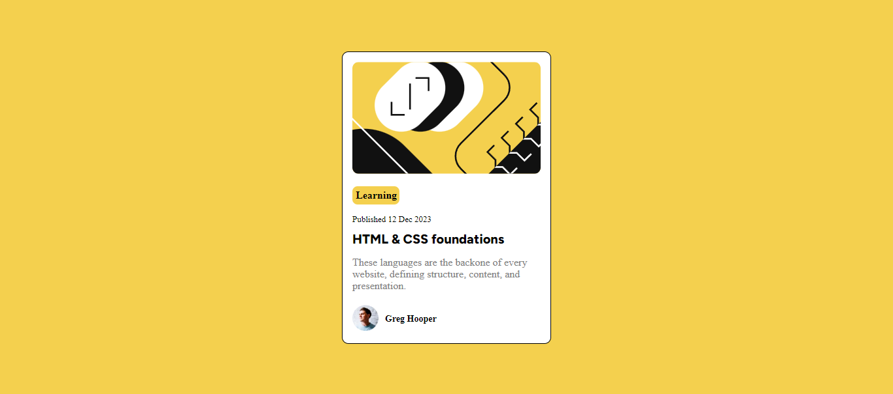

# Frontend Mentor - Blog preview card solution

This is a solution to the [Blog preview card challenge on Frontend Mentor](https://www.frontendmentor.io/challenges/blog-preview-card-ckPaj01IcS). Frontend Mentor challenges help you improve your coding skills by building realistic projects. 

## Overview

### The challenge

Users should be able to:

- See hover and focus states for all interactive elements on the page

### Screensh

### Links

- Solution URL: [Add solution URL here](https://github.com/JulioPe13/Blog-preview-card)
- Live Site URL: [https://blog-preview-card-psi-three.vercel.app/](https://blog-preview-card-psi-three.vercel.app/)

## My process

### Built with

- Semantic HTML5 markup
- CSS custom properties
- CSS Flexbox
- Mobile-first workflow

## Author

- Frontend Mentor - [@JulioPe13](https://www.frontendmentor.io/profile/JulioPe13)

